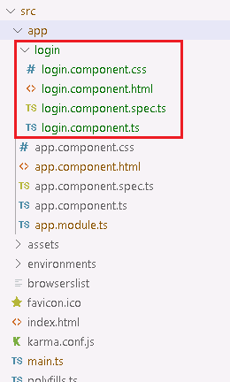

## 新建一个组件

目标：在首页增加一个组件并展示，其中`login works!`为组件的内容，效果如下：


1. 在`src\app`文件夹下，运行如下命令，新建一个名称为`login`的Component：

   ```bash
   ng generate Component login
   ```

   运行完之后，在`src\app`目录下，会自动生成一个`login`文件夹，并包含以下文件：

   

2. 修改`src\app\app.component.html`文件，如下：

   ```html
   <!--The content below is only a placeholder and can be replaced.-->
   <div style="text-align:center">
     <h1>
       Welcome to {{ title }}!
     </h1>
     
   </div>
   <h2>Here are some links to help you start: </h2>
   <app-login></app-login>
   ```

   最后一段代码是关键，引入了刚刚生成的login组件。

   >  <font color=red>想一下，为什么标签名是`app-login`？</font>
   >
   >  因为在`src\app\login\login.component.ts`中，`selector`的值为 `app-login`。这里的`selector`就是css中的选择器。除了标签选择器外，还支持以下选择方式：
   >
   >  1. ID选择
   >
   >    ```typescript
   >    // src\app\login\login.component.ts
   >    ...
   >    selector: '[id=login]'
   >    ...
   >    ```
   >
   >    ```html
   >    <!-- src\app\app.component.html-- >
   >    <div id="login"></div>
   >    ```
   >
   >  注意，ID选择器写成`#login`无效。
   >
   >  1. Class选择器
   >
   >    ```typescript
   >    // src\app\login\login.component.ts
   >    ...
   >    selector: '.login'
   >    ...
   >    ```
   >
   >    ```html
   >    <!-- src\app\app.component.html-- >
   >    <div class="login"></div>
   >    ```
   >
3. 保存后，查看页面，最终效果实现！