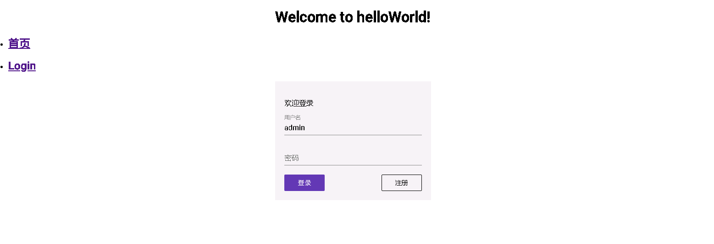

## 引入Material样式库

在VueJs项目中我们常用的是`element-ui`和`iview`样式库，在Angular项目，我们引入[Meterial组件库](https://material.angular.cn/components/categories)组件库，作为基础样式。

#### 1. 项目添加`@angular/material`依赖，类似于VueJs项目中的`npm install xxx`。

```bash
ng add @angular/material
```

#### 2.在`src\app\app.module.ts`中引入需要用到的Meterial组件

```typescript
import { BrowserModule } from '@angular/platform-browser';
import { NgModule } from '@angular/core';

import { AppComponent } from './app.component';
import { LoginComponent } from './login/login.component';

import { AppRouterModule } from './app-router.module';
import { BrowserAnimationsModule } from '@angular/platform-browser/animations'

// material
import { MatCheckboxModule, MatInputModule, MatFormFieldModule, MatButtonModule } from '@angular/material';

@NgModule({
  declarations: [
    AppComponent,
    LoginComponent
  ],
  imports: [
    BrowserModule,
    AppRouterModule,
    BrowserAnimationsModule,
    // material
    MatCheckboxModule,
    MatInputModule,
    MatFormFieldModule,
    MatButtonModule
  ],
  providers: [],
  bootstrap: [AppComponent]
})
export class AppModule { }

```

#### 3.修改Login组件。

##### 3.1 在`src\app\login\login.component.html`文件中，使用Meterial组件，做成登录框的样式。

```html
<div class="example-login-wrap">
  <p>欢迎登录</p>
  <form class="example-form">
    <mat-form-field class="example-full-width">
      <input [(ngModel)]="username" name="username" matInput placeholder="用户名"/>
    </mat-form-field>
    <mat-form-field class="example-full-width">
      <input [(ngModel)]="password" name="password" matInput type="password" placeholder="密码">
    </mat-form-field>
  </form>
  <div class="example-btns">
    <button mat-flat-button (click)="onLoginClick()">登录</button>
    <button mat-stroked-button (click)="onRegisterClick()">注册</button>
  </div>
</div>
```

##### 3.2 在`src\app\login\login.component.ts`增加变量`username`、`password`和`message`。

```typescript
import { Component, OnInit } from '@angular/core';

@Component({
  selector: '[id=login]',
  templateUrl: './login.component.html',
  styleUrls: ['./login.component.css']
})
export class LoginComponent implements OnInit {
  username: String = 'admin'
  password: String = ''
  message: String = '这个人很懒，什么也没留下'

  constructor() { }

  ngOnInit() {
  }
  onLoginClick () {
    alert('登录按钮click ' + this.username + ',' + this.password)
  }
  onRegisterClick () {
    alert('注册按钮click ' + this.username + ',' + this.password)
  }
}
```

##### 3.3 同时，加一些css样式，修改`src\app\login\login.component.css`文件：

```css
.example-login-wrap {
  background-color: #f1f1f1;
  width: 300px;
  padding: 20px;
  margin: 20px auto;
}
.example-form > .example-full-width {
  display: block;
}
.example-btns {
  display: flex;
  justify-content: space-between;
}
```

期间如遇到报错，请参考错误集锦中的问题 1和问题2。

最后效果图：

