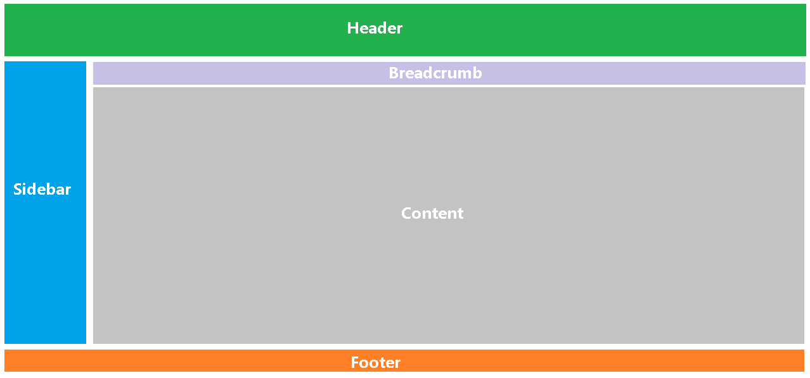
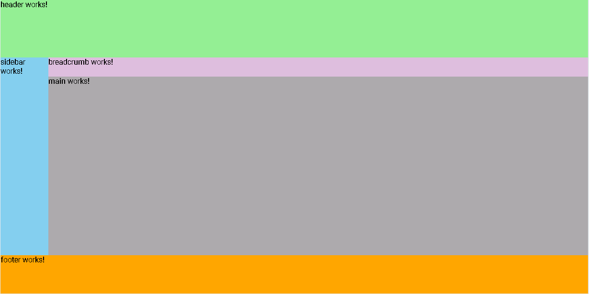

## 开始页面布局

本篇开始，采用angular的component，进行页面的布局，加上header和sidebar，以及foot等，让页面看起来像点样子。

### 整体布局

整体布局我们采用以下布局方式：



#### 引入less支持

参考How To中的如何支持less。

#### 使用弹性flex布局

1. 新增header、sidebar、breadcrumb和footer组件。使用如下命令：

   ```
   ng generate component header
   ```
   
1. 在`src\app\app.component.html`中布局：

   ```html
   <div id="app">
     <app-header></app-header>
     <div id="app_mid">
       <app-sidebar></app-sidebar>
       <div id="app_mid_r">
         <app-breadcrumb></app-breadcrumb>
         <app-main></app-main>
       </div>
     </div>
     <app-footer></app-footer>
   </div>
   ```

1. `src\app\app.component.less`中定义样式：

   ```less
   @header-height: 120px;
   @foot-height: 80px;
   @sidebar-width-open: 100px;
   @sidebar-width-close: 30px;
   @breadcrumb-height: 40px;
   #app {
     width: 100%;
     height: 100%;
     app-header {
       display: block;
       width: 100%;
       height: @header-height;
       background-color: lightgreen;
     }
     #app_mid {
       display: flex;
       width: 100%;
       height: calc(100% - @header-height - @foot-height);
       app-sidebar {
         display: block;
         width: @sidebar-width-open;
         height: 100%;
         flex-shrink: 0;
         background-color: skyblue;
       }
       #app_mid_r {
         width: 100%;
         flex-shrink: 1;
         app-breadcrumb {
           display: block;
           width: 100%;
           height: @breadcrumb-height;
           background-color: thistle;
         }
         app-main {
           display: block;
           width: 100%;
           height: calc(100% - @breadcrumb-height);
           background-color: #aaa;
         }
       }
     }
     app-footer {
       display: block;
       width: 100%;
       height: @foot-height;
       background-color: orange;
     }
   }
   ```
1. 最终效果：

   

#### 使用子路由

有了上面的布局好的主页面，配合之前添加的Login路由，我们引入子路由的概念。即Login和上图主页面的路由是平级的，上图页面还应包含子路由，在main里展示。

如何调整，参考How to中，如何添加子路由。注意，添加完子路由后`src\app\app.component.html`和`src\app\main\main.component.html`两个文件内容的变化，布局的html代码都放在了`src\app\main\main.component.html`中。

#### Header

