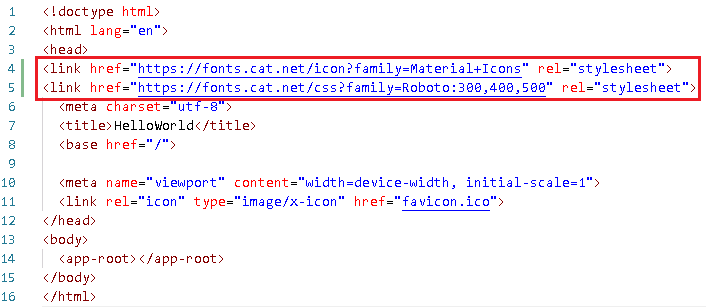
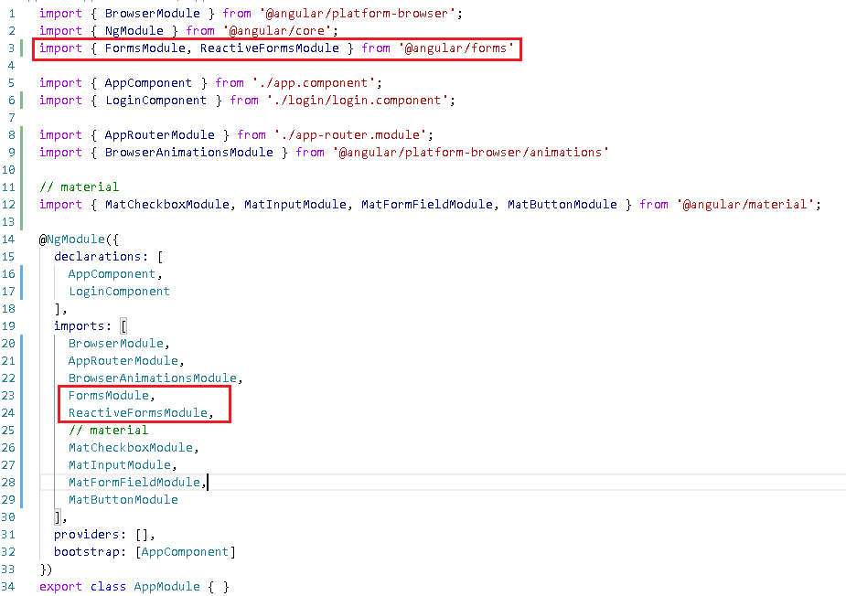

## 错误集锦

本篇用于记录Angular学习过程遇到的问题及解决方案。

1. 引入Meterial组件后，需要引用到`fonts.googleapis.com` 谷歌字体库，而国内网络原因，加载过慢甚至超时。

   **解决：**文件`src\index.html`中对字体的引用，将地址的域名改为：

   

   **参考：**[fonts.googleapis.com 谷歌字体库加载过慢解决方案](https://blog.csdn.net/q690080900/article/details/78338505)

   

1. 使用`ngModel`做数据绑定时，控制台报错：`Angular: Can't bind to 'ngModel' since it isn't a known property of 'input'`

   **解决：**文件`src\app\app.module.ts`增加引用：

   

   **参考**：[Angular: Can't bind to 'ngModel' since it isn't a known property of 'input'问题解决](https://blog.csdn.net/h363659487/article/details/78619225)

1. 运行`gn generate component xxx`命令失败，报错`More than one module matches. Use skip-import option to skip importing the component into the closest module.`

   **解决：**`src\app`文件夹内有2个module文件：`src\app\router.module.ts`和`src\app\app.module.ts`。正所谓一山不能容二虎，将`router.module.ts`文件重命名为`router.ts`即可。

   **参考：**[ng generate component Error More than one module matches. Use skip-import opti...](https://blog.csdn.net/itlionwoo/article/details/78445900)

