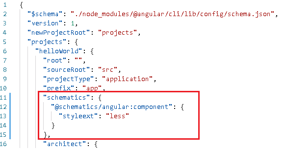

## How to

### 如何支持less

1. 修改文件`angular.json`，增加如下：
   

2. 将项目内的css文件的后缀改为less，同时`xxx.component.ts`中的css引用也要改为less。
3. 重新启动后，项目就支持less。

### 如何添加子路由

1. 目录结构如下图：

   

2. 在`src\app\app.component.html`文件中，添加一个路由视图：

   ```html
   <router-outlet></router-outlet>
   ```

3. 在`src\app\main\main.component.html`中，为主页面的布局：

   ```html
   <div id="app">
     <app-header></app-header>
     <div id="app_mid">
       <app-sidebar></app-sidebar>
       <div id="app_mid_r">
         <app-breadcrumb></app-breadcrumb>
         <div id="main">
           <router-outlet></router-outlet>
         </div>
       </div>
     </div>
     <app-footer></app-footer>
   </div>
   ```

4. 路由文件`src\app\app-router.ts`，定义路由：

   ```typescript
   import { NgModule } from '@angular/core'
   import { Routes, RouterModule } from '@angular/router'
   import { LoginComponent } from './login/login.component'
   import { MainComponent } from './main/main.component'
   import { DashboardComponent } from './main/dashboard/dashboard.component'
   
   const routes: Routes = [
     { path: 'login', component: LoginComponent},
     {
       path: 'home',
       component: MainComponent,
       children: [
         {
           path: 'dashboard',
           component: DashboardComponent
         }
       ]
     }
   ]
   
   @NgModule({
     imports: [RouterModule.forRoot(routes)],
     exports: [RouterModule]
   })
   export class AppRouterModule {}
   ```

5. url为`http://localhost:4200/home/dashboard`时的效果图，中间灰色部分显示的Dashboard的内容：

   

