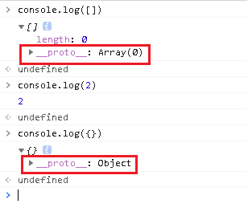
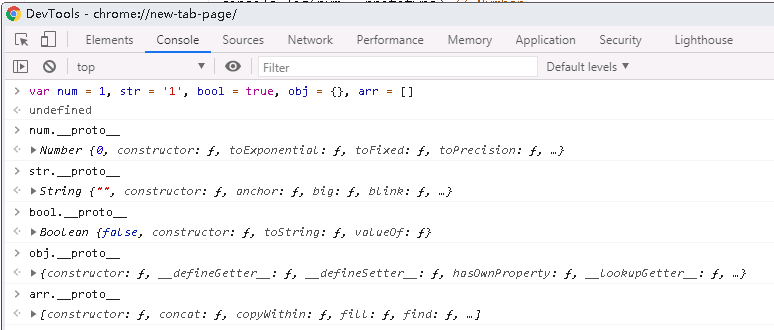
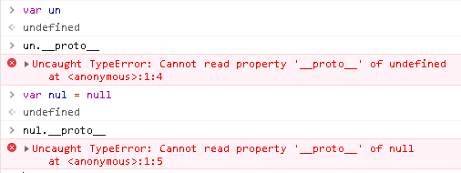
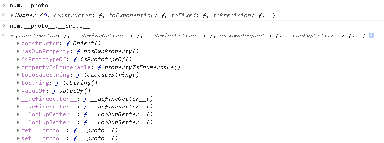
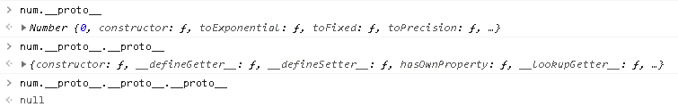
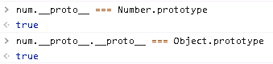
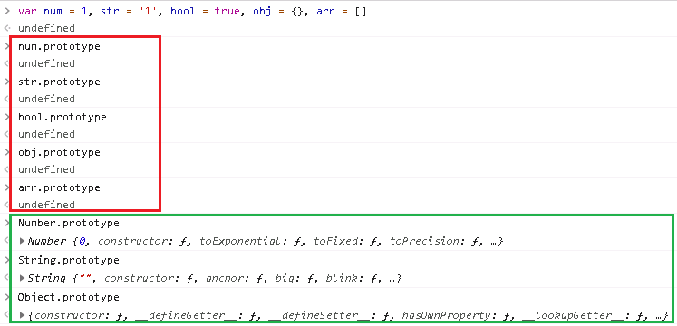
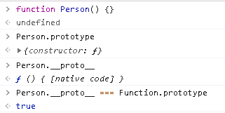

##  \_\_proto\_\_和prototype和constructor

### 1. \_\_proto\_\_原型链

#### 1.1 谁会有原型链

在JavaScript里，几乎每个变量都有`__proto__`属性，如下所示：



甚至对于Number和String等基础类型的变量，也会有`__proto__`：

```javascript
var num = 1, str = '1', bool = true, obj = {}, arr = []
console.log(num.__prototype) // Number
console.log(str.__prototype) // String
console.log(bool.__prototype) // Boolean
console.log(obj.__prototype) // {constructor: ƒ, __defineGetter__: ƒ, __defineSetter__: ƒ, hasOwnProperty: ƒ, __lookupGetter__: ƒ, …}
console.log(arr.__prototype) // [constructor: ƒ, concat: ƒ, copyWithin: ƒ, fill: ƒ, find: ƒ, …]
```

运行结果如下：



#### 1.2 谁没有原型链

`undefined`和`null`没有`__proto__`。



#### 1.3 原型链是什么

弄清除了谁有和谁没有`__proto__`后，我们再一起看看`__proto__`是什么？

从1.1的例子我们可以看出，`__proto__`指向的是自身的原型对象，也可以理解为父对象。如：`num`是`Number`类型，它的`__proto__`指向的就是`Number`。同理，`str`的`__proto__`就是`String`。

有没有想过，`num.__proto__`的`__proto__`是什么呢？我们看一下：



继续，再加一层`__proto__`呢？我们看到，当三层`__proto__`后，指向为null。



#### 1.4 原型链的概念

<font color="red">当我们访问JS对象中的某个属性时，首先在该对象自身内部查找，有则返回，没有的话，那么就会去`__proto__`属性所指向的那个对象里找，如果还不存在，则继续深入一层`__proto__`中查找，直到原型链顶端null，仍然找不到的话，则该属性不存在。像这种通过`__proto__`属性来连接对象直到null的链式结构，就是我们所谓的**原型链**。</font>

到这里，我们大致了解的原型链的由来。下面注意看，重点！看一下几层的`__proto__`各等于什么？



按照常规理解`num.__proto__`应该等于`Number`才对，但是事与愿违。这里又多了`prototype`属性，关于它的概念，我们看下一节。

### 2. prototype属性

#### 2.1 谁会有protype

同样，我们看一下谁会有`prototype`：



上图得到结论：

- 基础类型都没有`prototype`属性，包括`obj`和`arr`都没有。
- 像`Number`和`String`等对象才有`prototype`。而`Number`和`String`都为`function`类型，所以我们得出结论：<font color=red>只有函数才有`prototype`属性。</font>

下图，我们定义一个函数`Person`，它既有`prototype`属性，也有`__proto__`属性。



#### 2.2 `prototype`是什么

首先可以确定的是，`prototype`属性是函数特有，指向一个对象。

